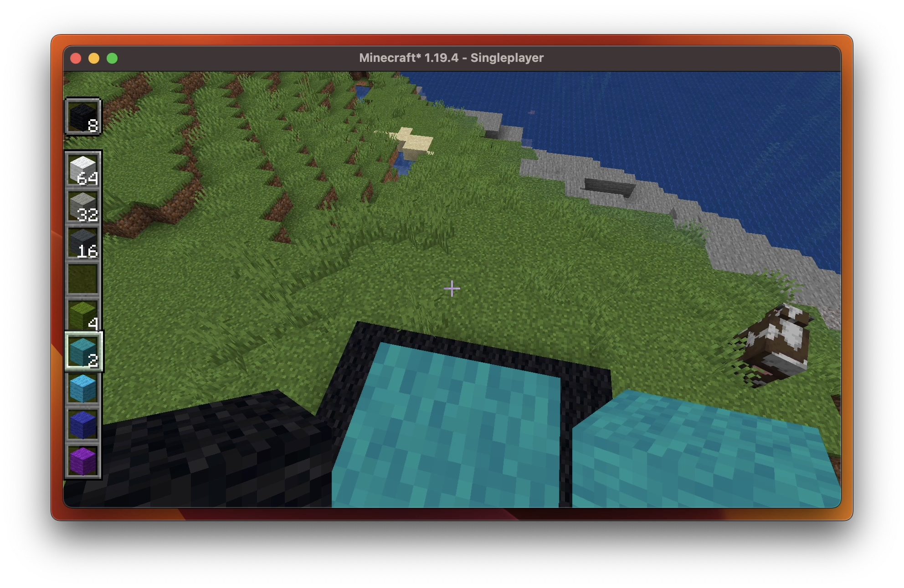

### 
[`→` Modrinth](https://modrinth.com/mod/verticality)

# Verticality

**Verticality** verticals your hotbar. Simple enough? Fascinating enough!

To toggle the function, just press `⎋ Escape` to access the game menu, then you'shall see arrows on the hotbar area. Click them to see what happens!

## License

**Verticality** is available under the **[GNU Public License.](LICENSE)**
